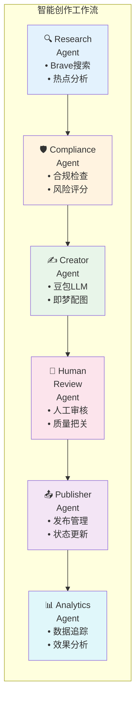

# 新媒体智能运营平台 🎯

AI驱动的内容创作工作台，实现从热点发现、智能创作到发布的全流程自动化。

> **最新架构**: LangGraph + Multi-Agent + 方舟大模型 + 即梦AI绘图

---

## ✨ 核心特性

- **🤖 Multi-Agent架构** - 6个Agent协作：Research → Compliance → Creator → Review → Publisher → Analytics
- **🔥 实时热点搜索** - Brave Search API 发现最新财经热点
- **📝 AI内容创作** - 豆包大模型生成小红书风格文案
- **🎨 AI配图生成** - 即梦/Seedream 自动生成精美配图
- **⚡ 异步Workflow** - LangGraph状态图编排，后台创作实时更新
- **🎨 精美UI** - 小红书风格配色，暗色主题

---

## 🚀 快速开始

### 方式一：Docker部署（推荐）

```bash
# 1. 克隆项目
git clone <repo-url>
cd xhs_platform

# 2. 配置环境变量
cp .env.example .env
# 编辑 .env 填入你的API Key

# 3. 启动服务
docker-compose up -d

# 4. 访问平台
open http://localhost
```

### 方式二：手动初始化数据库

```bash
# PostgreSQL
./scripts/init_db.sh

# 或 SQLite (开发)
DB_TYPE=sqlite ./scripts/init_db.sh
```

---

## 📋 环境变量配置

复制 `.env.example` 为 `.env`，填入以下必需配置：

```bash
# ============================================
# 必需：方舟大模型配置
# ============================================
ARK_API_KEY=your-ark-api-key
ARK_MODEL_ENDPOINT=ep-xxxxxxxxx    # 豆包文本模型
ARK_IMAGE_ENDPOINT=ep-xxxxxxxxx    # 即梦图像模型

# ============================================
# 必需：热点搜索配置
# ============================================
BRAVE_API_KEY=your-brave-api-key

# ============================================
# 可选：备选LLM
# ============================================
KIMI_API_KEY=
OPENAI_API_KEY=
```

**获取API Key**:
- 方舟大模型: https://console.volcengine.com/ark/
- Brave Search: https://brave.com/search/api/

---

## 🌐 服务访问

| 服务 | 地址 | 说明 |
|------|------|------|
| 🎯 Web界面 | http://localhost | 主控制台 |
| 📚 API文档 | http://localhost/api/docs | Swagger UI |
| 📊 API文档 | http://localhost/api/redoc | ReDoc |
| ✅ 健康检查 | http://localhost/health | 服务状态 |

---

## 🏗️ 系统架构

### LangGraph工作流



### 技术栈

| 层级 | 技术 |
|------|------|
| **后端** | FastAPI + Python 3.11 |
| **Agent框架** | LangGraph (状态图编排) |
| **LLM** | 方舟豆包 (文本) |
| **图像** | 方舟即梦/Seedream (配图) |
| **搜索** | Brave Search API |
| **数据库** | PostgreSQL 15 / SQLite |
| **缓存** | Redis 7 |
| **消息队列** | RabbitMQ |
| **前端** | Vue 3 + TypeScript + Tailwind CSS |
| **部署** | Docker + Docker Compose + Nginx |

---

## 📁 项目结构

```
xhs_platform/
├── 📄 README.md                 # 本文件
├── 📄 ARCHITECTURE.md           # 详细架构设计
├── 📄 docker-compose.yml        # Docker编排
├── 📄 .env.example              # 环境变量模板
│
├── 📁 scripts/                  # 数据库脚本
│   ├── init_db.sh              # 初始化脚本
│   ├── init_db.sql             # PostgreSQL
│   ├── init_db_sqlite.sql      # SQLite
│   └── README_DB.md            # 数据库指南
│
├── 📁 backend/                  # 后端服务
│   ├── app/
│   │   ├── agents/
│   │   │   └── orchestrator.py     # LangGraph工作流 ✅
│   │   ├── api/v1/
│   │   │   ├── agent.py            # Agent API ✅
│   │   │   ├── content.py          # 内容管理
│   │   │   └── hotspot.py          # 热点搜索
│   │   ├── models/
│   │   │   └── v4_models.py        # 数据模型
│   │   ├── services/
│   │   │   ├── llm.py              # 豆包LLM服务
│   │   │   ├── search.py           # Brave搜索
│   │   │   └── image.py            # 即梦配图
│   │   └── main.py                 # FastAPI入口
│   ├── Dockerfile
│   └── requirements.txt
│
├── 📁 frontend/                 # 前端应用
│   ├── src/
│   │   ├── components/         # UI组件
│   │   ├── composables/        # 可复用逻辑
│   │   │   ├── useContents.ts  # 内容管理
│   │   │   └── useWorkflow.ts  # 工作流
│   │   ├── services/           # API服务
│   │   ├── views/              # 页面
│   │   │   ├── Dashboard.vue   # 主控制台 ✅
│   │   │   └── HotspotList.vue # 热点库
│   │   └── App.vue
│   ├── Dockerfile
│   └── package.json
│
└── 📁 nginx/                    # Nginx配置
    └── nginx.conf
```

---

## 🎯 核心功能

### 1️⃣ 智能创作

1. 点击「开始创作」按钮
2. Research Agent 搜索实时热点
3. Compliance Agent 检查合规性
4. Creator Agent 调用豆包生成文案 + 即梦生成配图
5. 人工审核并一键发布

### 2️⃣ 内容管理

- **状态流转**: 创作中 → 待审核 → 已通过 → 已发布
- **内容预览**: 小红书风格预览
- **一键复制**: 标题 + 正文 + 标签
- **配图下载**: AI生成图片

### 3️⃣ 热点发现

- **实时搜索**: Brave Search API
- **智能分类**: 信用卡/货币政策/利率/基金/养老/贵金属/房产
- **热度评分**: AI分析热点价值

---

## 🛠️ 常用命令

```bash
# 启动服务
docker-compose up -d

# 停止服务
docker-compose down

# 重启API
docker-compose restart api

# 查看日志
docker-compose logs -f api

# 进入容器
docker-compose exec api bash

# 数据库操作
docker exec xhs_postgres psql -U postgres -d xhs_platform

# 清空数据（危险！）
docker exec xhs_postgres psql -U postgres -d xhs_platform \
  -c "TRUNCATE contents, hot_topics, workflow_logs RESTART IDENTITY;"

# 完全重置
docker-compose down -v
docker-compose up -d
```

---

## 📚 文档索引

| 文档 | 说明 |
|------|------|
| [ARCHITECTURE.md](./ARCHITECTURE.md) | 详细架构设计 |
| [scripts/README_DB.md](./scripts/README_DB.md) | 数据库使用指南 |
| http://localhost/api/docs | API Swagger文档 |

## 🧪 相关项目

- **测试监控平台**: [xhs-platform-tests](https://github.com/Jenny-Huijing/xhs-platform-tests) - 独立的测试报告、监控、分析平台

---

## 🔧 故障排查

### 创作失败？

检查API Key配置：
```bash
docker logs xhs_api | grep -E "LLM|error|失败"
```

### 数据库错误？

重新初始化：
```bash
./scripts/init_db.sh
```

### 端口被占用？

修改 `docker-compose.yml` 中的端口映射。

---

## 📝 更新日志

### v1.0.0 (2026-02-12)

- ✅ LangGraph + Multi-Agent 架构
- ✅ 方舟豆包大模型接入
- ✅ 即梦AI配图生成
- ✅ Brave Search热点搜索
- ✅ Docker一键部署
- ✅ 数据库初始化脚本

---

## 📄 许可证

MIT License

---

**维护**: 小珑宝 🤖 | **最后更新**: 2026-02-12
