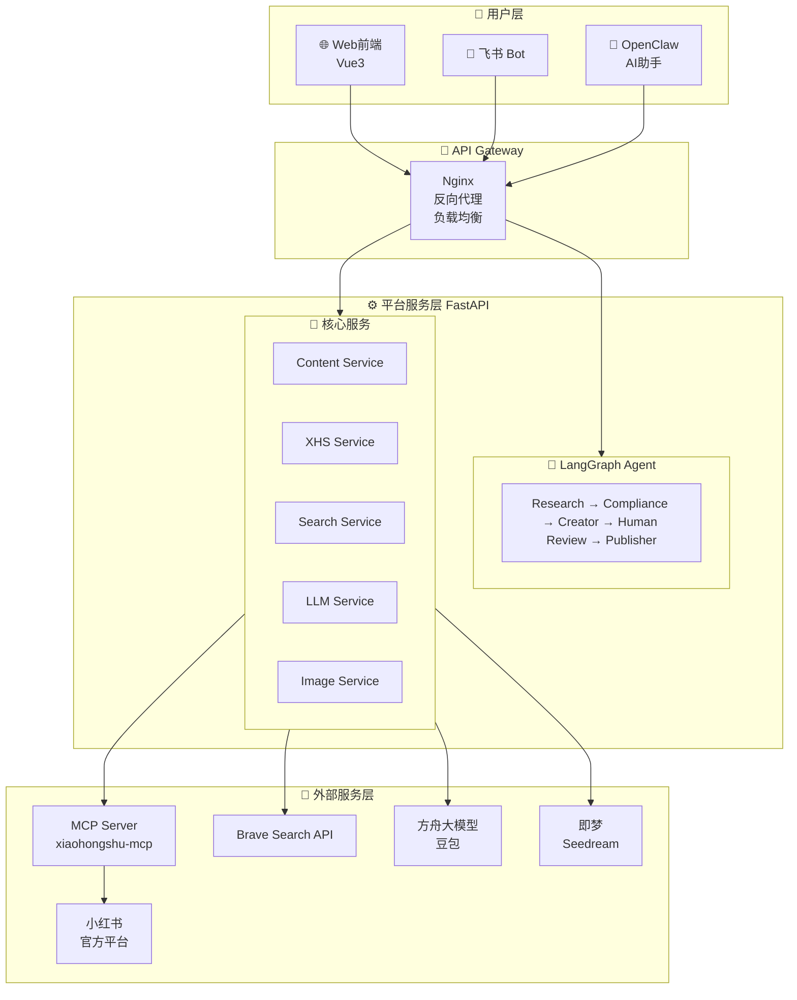
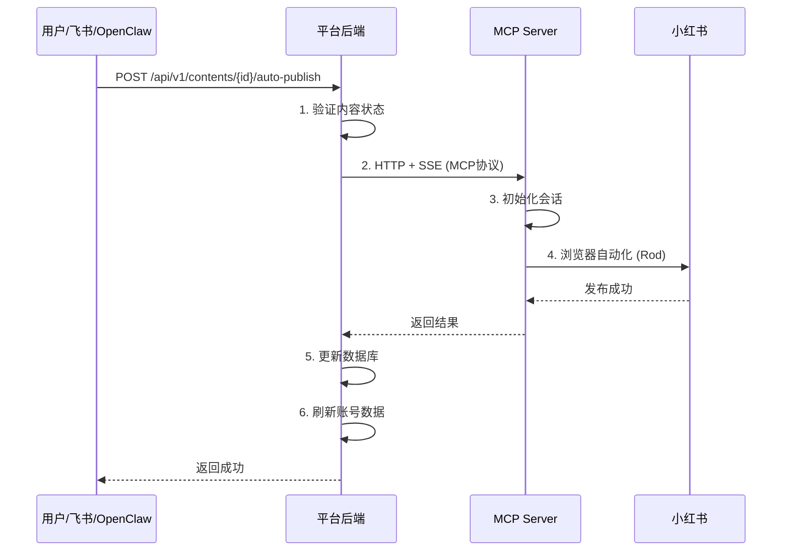
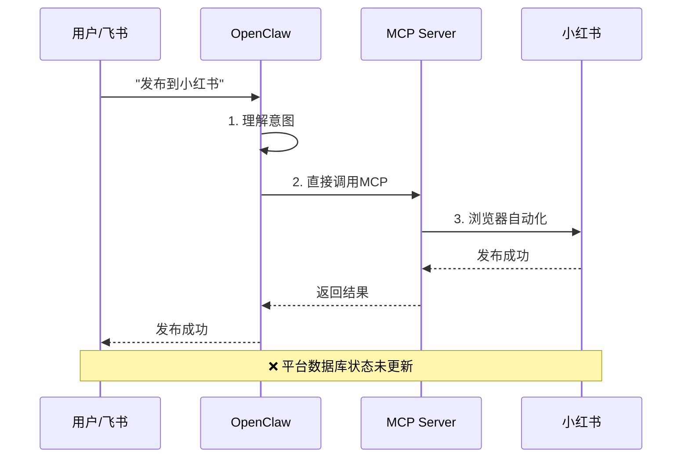
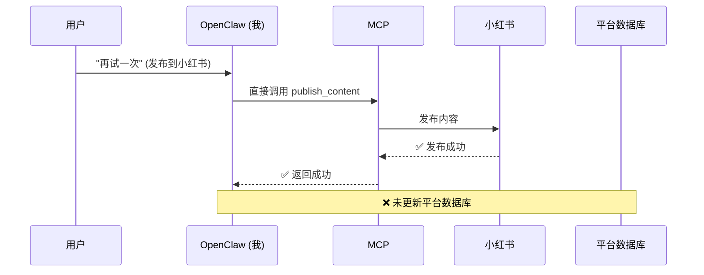
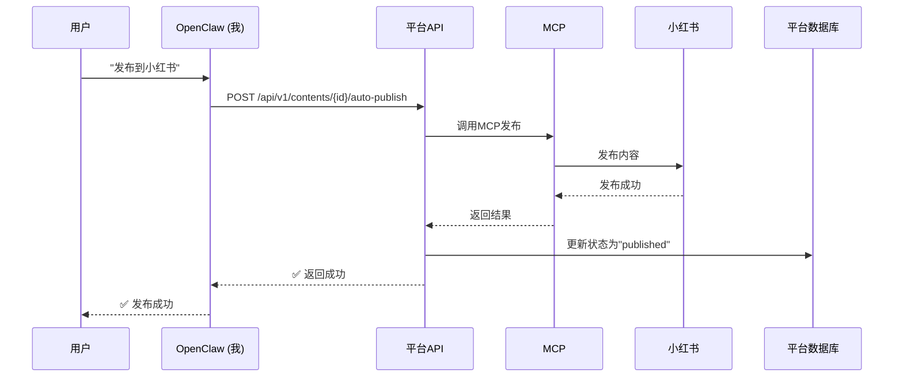

# 系统架构与交互关系说明

## 1. 整体架构概览



## 2. OpenClaw 与平台的交互关系

### 2.1 交互方式对比

| 场景 | 交互方式 | 数据一致性 | 推荐使用 |
|------|----------|-----------|----------|
| **平台内发布** | 前端 → 平台API → MCP → 小红书 | ✅ 强一致 | ⭐ 推荐 |
| **OpenClaw直接发布** | OpenClaw → MCP → 小红书 | ❌ 弱一致 | 不推荐 |
| **OpenClaw通过平台发布** | OpenClaw → 平台API → MCP → 小红书 | ✅ 强一致 | ⭐ 推荐 |

### 2.2 正确的发布流程

#### 方案 A：通过平台 API 发布（推荐）



**优点：**
- 平台记录与实际操作强一致
- 可追踪发布历史
- 支持审计和回滚
- 前端可实时显示发布状态

#### 方案 B：OpenClaw 直接发布（不推荐用于生产）



**问题：**
- ❌ 平台数据库状态未更新
- ❌ 发布记录丢失
- ❌ 统计数据不一致
- ✅ 速度快（少了一层转发）

### 2.3 实际案例：今天的发布

**发生的事情：**



**结果:**
- 小红书: 内容已发布 ✅
- 平台数据库: 状态仍为 "approved" ❌
- 数据不一致！

**正确的做法应该是：**



**结果:**
- 小红书: 内容已发布 ✅
- 平台数据库: 状态为 "published" ✅
- 数据一致 ✅

## 3. 数据同步机制

### 3.1 定时同步

```python
# 每小时执行一次
@celery.task
def sync_xhs_account_data():
    """同步小红书账号数据"""
    stats = await fetch_account_stats()
    # 更新缓存和数据库
```

### 3.2 实时同步（特定操作后）

```python
# 发布成功后立即同步
async def after_publish_hook():
    await asyncio.sleep(5)  # 等待小红书数据更新
    await refresh_account_stats()
    await clear_cache()
```

### 3.3 触发条件

| 操作 | 同步方式 | 延迟 |
|------|----------|------|
| 发布内容 | 实时 | 5秒后 |
| 删除内容 | 实时 | 立即 |
| 日常数据 | 定时 | 每小时 |
| 手动刷新 | 实时 | 立即 |

## 4. 建议的改进方案

### 4.1 短期（已实现）

1. ✅ 创建 `/api/v1/contents/{id}/auto-publish` API
2. ✅ 发布后自动刷新账号数据
3. ✅ 更新前端显示（累积确认 → 累积发布）

### 4.2 中期

1. **统一发布入口**
   - 所有发布必须通过平台 API
   - OpenClaw 不再直接调用 MCP
   - 飞书 Bot 调用平台 API

2. **状态同步 WebSocket**
   - 发布后实时推送状态变更
   - 前端无需轮询

3. **发布重试机制**
   - MCP 超时自动重试
   - 失败后可从平台重新发起

### 4.3 长期

1. **发布队列**
   - 异步处理发布请求
   - 支持批量发布
   - 支持定时发布

2. **发布历史追踪**
   - 记录每次发布尝试
   - 支持查看发布详情
   - 支持撤回已发布内容

## 5. 总结

**核心原则：**
1. **数据一致性优先** - 所有操作必须通过平台 API
2. **单一数据源** - 平台数据库是唯一的真实来源
3. **操作可追溯** - 所有发布行为都要记录在案

**正确的使用方式：**
- ✅ 用户通过 Web 界面发布 → 调用平台 API
- ✅ OpenClaw 协助发布 → 调用平台 API（而非直接 MCP）
- ✅ 飞书 Bot 发布 → 调用平台 API
- ❌ 任何组件直接调用 MCP（数据不一致风险）

**今天的教训：**
直接调用 MCP 虽然能发布成功，但破坏了数据一致性。以后所有发布操作都应该通过平台 API 进行。
