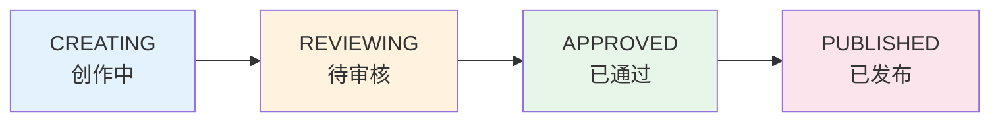
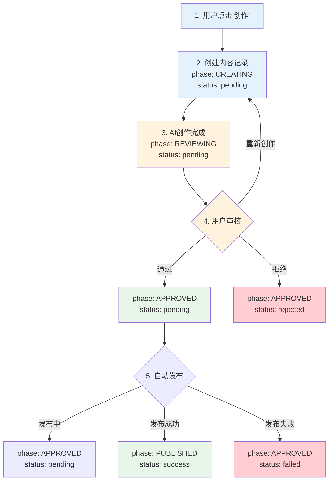

# 小红书智能运营平台 - 内容状态设计

## 当前问题

现在 `status` 字段混合了"阶段"和"状态"的概念，导致逻辑混乱：
- `CREATING` - 阶段：创作中
- `reviewing` - 阶段：待审核
- `approved` - 阶段：已通过
- `published` - 阶段：已发布
- `rejected` - 阶段：已拒绝（+ 状态）
- `PUBLISH_FAILED` - 状态：发布失败（但阶段不明确）
- `failed` - 状态：创作失败

## 新设计方案

### 分离"阶段"和"状态"

#### 1. 阶段（phase）- 内容生命周期
内容在流程中的位置，单向流动：



#### 2. 状态（status）- 执行结果
每个阶段的执行结果：
- `pending` - 进行中/等待中
- `success` - 成功
- `failed` - 失败
- `rejected` - 被拒绝

### 组合使用

| 阶段 | 状态 | 显示文字 | 含义 |
|------|------|----------|------|
| CREATING | pending | 创作中 | AI正在创作内容 |
| CREATING | failed | 创作失败 | 创作过程中出错 |
| REVIEWING | pending | 待审核 | 等待用户审核 |
| APPROVED | pending | 审核通过，发布中 | 审核通过，正在发布 |
| APPROVED | failed | 发布失败 | 审核通过，但发布失败 |
| PUBLISHED | success | 已发布 | 发布成功 |
| APPROVED | rejected | 已拒绝 | 用户拒绝此内容 |

### 数据库字段

```sql
ALTER TABLE contents ADD COLUMN phase VARCHAR(20) DEFAULT 'CREATING';
ALTER TABLE contents ADD COLUMN status VARCHAR(20) DEFAULT 'pending';
ALTER TABLE contents ADD COLUMN error_message TEXT;

-- 旧数据迁移
-- CREATING -> phase: CREATING, status: success/pending/failed
-- reviewing -> phase: REVIEWING, status: pending
-- approved -> phase: APPROVED, status: pending
-- published -> phase: PUBLISHED, status: success
-- rejected -> phase: APPROVED, status: rejected
-- PUBLISH_FAILED -> phase: APPROVED, status: failed
-- failed -> phase: CREATING, status: failed
```

### 前端展示逻辑

#### 阶段标签（主要展示）
```vue
<span :class="phaseClass(content.phase)">
  {{ phaseLabel(content.phase) }}
</span>
```

#### 状态标签（次要展示，只在非pending时显示）
```vue
<span v-if="content.status !== 'pending' && content.status !== 'success'" 
      :class="statusClass(content.status)">
  {{ statusLabel(content.status) }}
</span>
```

### 操作按钮逻辑

| 阶段 | 状态 | 可执行操作 |
|------|------|-----------|
| CREATING | pending | 无（等待中） |
| CREATING | failed | 删除、重新创作 |
| REVIEWING | pending | 通过、拒绝、重新创作 |
| APPROVED | pending | 发布（自动） |
| APPROVED | failed | 重试发布 |
| PUBLISHED | success | 查看、复制链接 |
| APPROVED | rejected | 删除、重新创作 |

### 工作流程



## 优势

1. **逻辑清晰**：阶段表示内容在流程中的位置，状态表示执行结果
2. **可扩展**：容易添加新的阶段（如 SCHEDULED-定时发布）或状态
3. **操作明确**：根据阶段+状态组合，清晰知道可执行什么操作
4. **用户友好**：发布失败后停留在"已通过"阶段，用户知道只需要重试发布

## 实现建议

### 后端修改
1. 添加 `phase` 和 `status` 字段
2. 更新所有状态判断逻辑
3. 迁移旧数据

### 前端修改
1. 更新状态显示组件
2. 更新操作按钮逻辑
3. 添加阶段进度条（可选）
